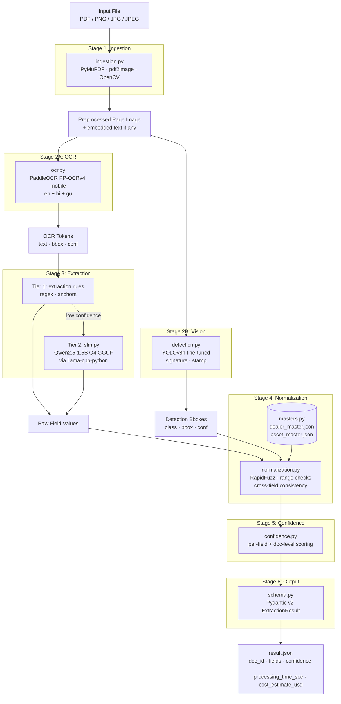
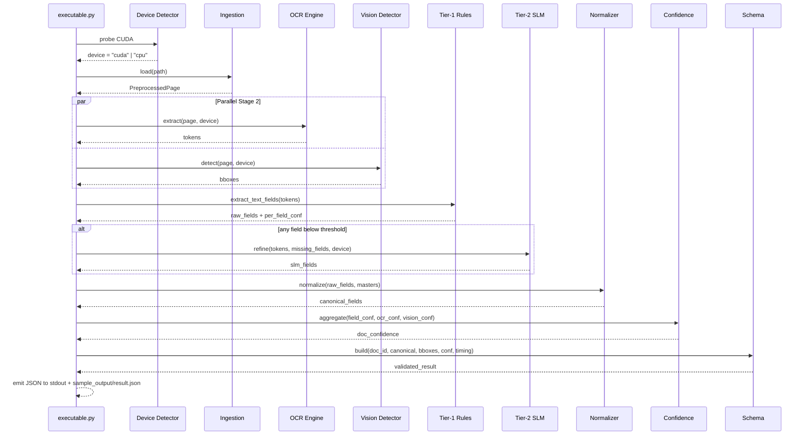
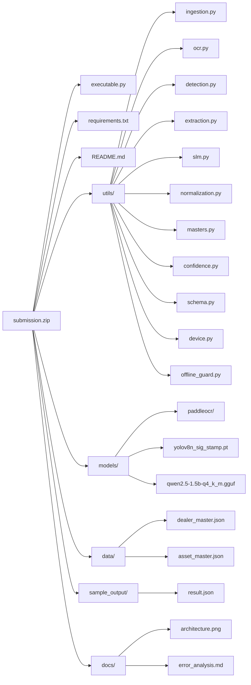

# Design Document

## Overview

The Invoice Extraction Pipeline is a six-stage Python system that converts a single PDF or image input into a Pydantic-validated JSON object containing six structured fields. The design optimizes for three hard constraints: 100% offline operation, $0 marginal cost, and ≤30s p95 latency on commodity CPU hardware.

The design follows three principles:

1. **Cheap-first cascade.** Every stage that can be solved with deterministic rules runs before any model is invoked. The SLM only fires for fields the rules failed on, and never sees pixels — only OCR text.
2. **Single source of truth for IO.** A Pydantic model defines the output JSON shape; every module that produces a field hands back a typed object that contributes to that model. No string-formatted JSON is produced anywhere except at the final serialization boundary.
3. **Hardware-agnostic same artifact.** The same submission zip runs on a CPU laptop or a low-tier GPU. CUDA detection happens once at startup and propagates a single `Device` enum to every model loader.

The pipeline is wrapped by a thin CLI (`executable.py`) and an optional FastAPI bridge (`demo/server.py`) that serves the same code over localhost for the React frontend during the live demo round.

## Architecture

### Top-level component diagram



### Sequence: single document end-to-end



### Submission package layout



## Components and Interfaces

Every module exposes a small, typed public API. Internals are free to evolve. All public functions accept the resolved `Device` so that GPU/CPU choice is centralized.

### `utils/device.py` — Hardware detection

```python
from enum import Enum
from dataclasses import dataclass

class Device(str, Enum):
    CPU = "cpu"
    CUDA = "cuda"

@dataclass(frozen=True)
class DeviceInfo:
    kind: Device
    cuda_index: int | None  # None on CPU, else 0
    description: str        # e.g. "NVIDIA GeForce RTX 3050"

def detect() -> DeviceInfo: ...
```

`detect()` calls `torch.cuda.is_available()` exactly once. Logs the result to stderr at startup. Every other module imports this and never calls `torch.cuda` directly.

### `utils/offline_guard.py` — Network kill-switch

```python
def enable_offline_mode() -> None: ...
def assert_no_network_calls_made() -> None: ...
```

`enable_offline_mode()`:
1. Sets `os.environ["HF_HUB_OFFLINE"] = "1"` and `TRANSFORMERS_OFFLINE = "1"`
2. Monkey-patches `socket.socket.connect` to raise `OfflineViolation` for any non-loopback address
3. Wraps `urllib.request.urlopen` and `requests.adapters.HTTPAdapter.send` to raise on call

Called at the very top of `executable.py` before any model library is imported.

### `utils/schema.py` — Output contract

```python
from pydantic import BaseModel, Field
from typing import Literal

Bbox = tuple[int, int, int, int]  # x1, y1, x2, y2

class TextField(BaseModel):
    value: str | None
    confidence: float = Field(ge=0.0, le=1.0)

class NumericField(BaseModel):
    value: int | None
    confidence: float = Field(ge=0.0, le=1.0)

class VisualField(BaseModel):
    present: bool
    bbox: Bbox | None
    confidence: float = Field(ge=0.0, le=1.0)

class Fields(BaseModel):
    dealer_name: TextField
    model_name: TextField
    horse_power: NumericField
    asset_cost: NumericField
    signature: VisualField
    stamp: VisualField

class ExtractionResult(BaseModel):
    doc_id: str
    fields: Fields
    confidence: float = Field(ge=0.0, le=1.0)
    processing_time_sec: float
    cost_estimate_usd: float
    error: str | None = None
```

The output JSON shape is what the PS specifies. The Pydantic model is the only place we enforce it. Pydantic's `model_dump_json()` is the only serializer used.

### `utils/ingestion.py` — Stage 1

```python
from PIL import Image
from pathlib import Path
from dataclasses import dataclass

@dataclass
class PreprocessedPage:
    image: Image.Image          # post-deskew, post-denoise
    embedded_text: str | None   # only if digital PDF, else None
    page_index: int             # 0-based
    source_path: Path
    page_count: int

def load(path: Path) -> PreprocessedPage: ...
```

Internally, `load()` dispatches by extension:

- `.pdf` → PyMuPDF first; if every page has empty text layer, fall back to `pdf2image.convert_from_path(dpi=300)`
- `.png` / `.jpg` / `.jpeg` → `Image.open()` directly, single-page document

After loading, every page goes through:

1. **Deskew** (`OpenCV.minAreaRect` on connected components; rotate by detected angle)
2. **Denoise** (`cv2.fastNlMeansDenoising`)
3. **Contrast normalization** (CLAHE on Y channel of YCrCb)

For multi-page PDFs, `_score_relevance(page)` returns a relevance score combining:
- Presence of currency anchors (`₹`, `Rs.`, `Total`, `Grand Total`)
- Presence of HP anchors (`HP`, `H.P.`)
- Presence of brand keywords from `asset_master.json`
- Detection of a tabular layout via Hough-line density

The highest-scoring page becomes the `PreprocessedPage` returned. Other pages are discarded — we only do deep extraction on one page per document.

### `utils/ocr.py` — Stage 2A

```python
from utils.device import DeviceInfo

@dataclass
class OcrToken:
    text: str
    bbox: Bbox
    confidence: float
    script: Literal["en", "hi", "gu", "mixed"]

class OcrEngine:
    def __init__(self, device: DeviceInfo, models_dir: Path): ...
    def extract(self, page: PreprocessedPage) -> list[OcrToken]: ...
```

`OcrEngine` instantiates a single `paddleocr.PaddleOCR(use_gpu=device.kind == Device.CUDA)` with `det_model_dir`, `rec_model_dir`, `cls_model_dir` all pointing into `models/paddleocr/`. The engine is a singleton — instantiated once in `executable.py`, reused per document.

Script detection is a post-processing step:
- Tokens with codepoints in `[\u0900-\u097F]` → `hi`
- Tokens with codepoints in `[\u0A80-\u0AFF]` → `gu`
- Tokens with mixed → `mixed`
- Else → `en`

### `utils/detection.py` — Stage 2B

```python
@dataclass
class Detection:
    cls: Literal["signature", "stamp"]
    bbox: Bbox
    confidence: float

class VisionDetector:
    def __init__(self, device: DeviceInfo, weights_path: Path): ...
    def detect(self, page: PreprocessedPage) -> list[Detection]: ...
```

Wraps `ultralytics.YOLO("models/yolov8n_sig_stamp.pt")`. Ultralytics handles device selection internally when given `device="cuda:0"` or `device="cpu"`.

Per-class confidence threshold defaults: signature 0.35, stamp 0.40. Configurable via `models/detection.yaml`.

### `utils/extraction.py` — Stage 3

```python
@dataclass
class FieldExtraction:
    name: str       # "dealer_name" | "model_name" | "horse_power" | "asset_cost"
    value: str | int | None
    confidence: float
    source: Literal["tier1", "tier2", "none"]
    evidence_token_ids: list[int]   # indices into the OcrToken list

def extract_text_fields(
    tokens: list[OcrToken],
    embedded_text: str | None,
    asset_master: AssetMaster,
) -> dict[str, FieldExtraction]: ...
```

#### Tier-1 strategy (rules)

For each field, a list of `(anchor_pattern, value_extractor)` pairs ranked by precision. The first matching anchor whose value passes the field's sanity check wins. Confidence formula:

```
tier1_conf = anchor_precision × ocr_token_conf × proximity_bonus × sanity_bonus
```

Where:
- `anchor_precision` ∈ [0.5, 1.0] — hand-tuned based on how often the anchor produces wrong values
- `ocr_token_conf` — minimum OCR confidence among tokens forming the value
- `proximity_bonus = clamp(1.0 - (token_distance / 80px) × 0.3, 0.7, 1.0)`
- `sanity_bonus` — 1.0 if value is in domain range, 0.5 if just outside, 0.0 if rejected

Field-specific anchors:

| Field | Primary anchors | Validation |
|---|---|---|
| `dealer_name` | `Dealer`, `M/s`, `M/S`, `मेसर्स`, top-letterhead region | Length 4–80, ASCII letters dominant |
| `model_name` | `Model`, `Tractor`, brand keywords from asset master | Length 3–50, contains a digit run |
| `horse_power` | `\d+\s*(HP\|H\.P\.\|hp\|बल\|एचपी\|બળ)` | Integer in [15, 150] |
| `asset_cost` | `Total`, `Grand Total`, `Net Amount`, `₹`, `Rs.`, `INR`, `कुल` | Integer in [100000, 5000000] after currency strip |

Tier-1 returns a `dict[str, FieldExtraction]` with all four keys present. Missing or rejected fields have `value=None, confidence=0.0, source="none"`.

#### Tier-2 trigger

For each field where `tier1_conf < threshold` (default 0.55), call SLM_Fallback. The SLM is invoked once per document (not once per field) — all missing fields are requested in a single prompt. This caps SLM latency at ~3s per document worst case.

### `utils/slm.py` — Stage 3 Tier 2

```python
class SlmFallback:
    def __init__(self, device: DeviceInfo, model_path: Path): ...
    def refine(
        self,
        ocr_text: str,
        missing_fields: list[str],
    ) -> dict[str, str | int | None]: ...
```

Loads `llama_cpp.Llama(model_path=models/qwen2.5-1.5b-q4_k_m.gguf, n_gpu_layers=-1 if cuda else 0, n_ctx=4096)`.

#### Prompt template

```
<|im_start|>system
You are a data extraction engine. From the OCR text of a tractor invoice, extract ONLY the requested fields.
Return strictly valid JSON. Do not invent values. If a field is not present in the text, return null.
For text fields, return the value EXACTLY as it appears in the OCR text (verbatim substring).
For numeric fields, return integers only. No currency symbols, no commas.
<|im_end|>
<|im_start|>user
OCR_TEXT:
"""
{ocr_text}
"""

REQUESTED_FIELDS: {missing_fields_json}

OUTPUT_SCHEMA:
{{
  "dealer_name": "string or null",
  "model_name": "string or null",
  "horse_power": "integer or null",
  "asset_cost": "integer or null"
}}

Return ONLY the JSON object for the REQUESTED_FIELDS. No prose.
<|im_end|>
<|im_start|>assistant
```

The output is parsed with `json.loads`. If parsing fails, retry once with `temperature=0.0`. If still failing, return all-nulls.

#### Anti-hallucination check

After SLM returns, for `dealer_name` and `model_name`:
```
slm_value_normalized = whitespace_collapse(slm_value).lower()
ocr_text_normalized = whitespace_collapse(ocr_text).lower()
if slm_value_normalized not in ocr_text_normalized:
    reject — keep tier1 value
```

Numeric fields are also sanity-checked against domain ranges (Requirements 6.5 and 7.5).

### `utils/normalization.py` — Stage 4

```python
@dataclass
class NormalizedField:
    value: str | int | None
    confidence: float
    canonical_match: str | None    # name of the master entry matched, or None
    match_score: float | None      # fuzzy ratio 0-100, or None

def normalize(
    extractions: dict[str, FieldExtraction],
    masters: Masters,
) -> dict[str, NormalizedField]: ...
```

Operations per field:

- **dealer_name**: `rapidfuzz.fuzz.token_set_ratio` against every entry in `dealer_master.json["entries"][*].canonical` and aliases. If best ≥ 90, swap raw for canonical and bump confidence by 0.1 (capped at 1.0). If 70–89, keep raw, multiply confidence by 0.85. If <70, keep raw, multiply confidence by 0.5.
- **model_name**: case-insensitive whitespace-normalized exact match against `asset_master.json["entries"][*].full_name`. On match, swap to canonical. On miss, keep raw, multiply confidence by 0.7.
- **horse_power**: integer coercion. Reject if outside [15, 150]. No master.
- **asset_cost**: integer coercion. Reject if outside [100K, 5M]. Cross-field check: lookup `expected_cost_band(horse_power)` from a calibrated table; if `asset_cost` outside ±50% of band midpoint, multiply confidence by 0.8.

### `utils/masters.py` — Master loading and mining

```python
@dataclass
class DealerEntry:
    canonical: str
    aliases: list[str]
    frequency: int

@dataclass
class AssetEntry:
    brand: str
    model: str
    full_name: str        # "{brand} {model}"

class Masters:
    dealer: list[DealerEntry]
    asset: list[AssetEntry]

def load(data_dir: Path) -> Masters: ...

# Build-time only, NOT called at inference:
def mine_dealer_master(train_dir: Path, ocr: OcrEngine) -> list[DealerEntry]: ...
def mine_asset_master(train_dir: Path, ocr: OcrEngine, seed_brands: list[str]) -> list[AssetEntry]: ...
```

#### Master mining algorithm

`mine_dealer_master`:
1. Run OCR on every file in `train_data_idfc/train/`
2. For each document, extract candidate dealer-name strings using the same anchors as Tier-1 plus letterhead-region heuristics
3. Lowercase and whitespace-normalize candidates
4. Cluster using `rapidfuzz.process.cdist` with `token_set_ratio` ≥ 85; greedy single-linkage
5. For each cluster, the most frequent string becomes `canonical`, all others become `aliases`, `frequency` is cluster size
6. Filter clusters with `frequency` < 2 (likely OCR noise)
7. Sort by `canonical` ascending and write `data/dealer_master.json`

`mine_asset_master`:
1. Same OCR pass as above (cached)
2. Use a bundled `data/seed_brands.txt` containing the 12 known Indian tractor brands (Mahindra, Sonalika, John Deere, Massey Ferguson, Swaraj, New Holland, Eicher, Powertrac, Farmtrac, Kubota, Force, HMT)
3. For each document, find tokens matching brand keywords; extract trailing model identifiers using the regex `\b\d{2,4}\s*(DI|XL|TX|SL|MX|XP|FX)?\s*(\w{1,4})?\b`
4. Build `(brand, model, full_name)` triples. Deduplicate
5. Union with hand-curated list of common (brand, model) pairs for resilience
6. Sort by `full_name` ascending and write `data/asset_master.json`

Both miners are offline — they call `OcrEngine.extract` only.

### `utils/confidence.py` — Stage 5

```python
def aggregate(
    text_fields: dict[str, NormalizedField],
    visual_fields: dict[str, VisualField],
) -> tuple[dict[str, float], float]:
    """Returns (per_field_confidences, doc_level_confidence)."""
```

Document-level confidence formula:

```
weights = {
    dealer_name: 0.20,
    model_name:  0.20,
    horse_power: 0.15,
    asset_cost:  0.20,
    signature:   0.125,
    stamp:       0.125,
}
doc_conf = sum(weights[f] × per_field_conf[f] for f in fields)
```

Weights sum to 1.0. If any field has confidence == 0 (i.e. null value), the corresponding weight is redistributed equally to the others before computing — this prevents one missing field from dragging doc confidence below useful thresholds.

### `executable.py` — CLI orchestrator

```python
def main():
    args = parse_args()
    if args.offline:
        offline_guard.enable_offline_mode()
    device = device.detect()
    log_startup(device)

    masters = masters.load(MODELS_DIR)
    ocr = OcrEngine(device, MODELS_DIR / "paddleocr")
    vision = VisionDetector(device, MODELS_DIR / "yolov8n_sig_stamp.pt")
    slm = SlmFallback(device, MODELS_DIR / "qwen2.5-1.5b-q4_k_m.gguf")

    if args.batch:
        for input_path in iter_supported_files(args.batch):
            result = process_one(input_path, ocr, vision, slm, masters)
            print(result.model_dump_json())
    else:
        result = process_one(args.input, ocr, vision, slm, masters)
        out_path = args.output or DEFAULT_OUTPUT
        out_path.write_text(result.model_dump_json(indent=2))
        print(result.model_dump_json())
```

The `process_one` function is the only place where stages are wired together. It handles timing, exception isolation per stage, and the partial-result error path.

### Demo bridge — `demo/server.py` (not in submission zip)

Thin FastAPI wrapper:

```python
from fastapi import FastAPI, UploadFile
from utils import schema  # imported from a sibling sys.path entry

app = FastAPI()
PIPELINE = None  # initialized at startup

@app.on_event("startup")
def _init():
    global PIPELINE
    PIPELINE = build_pipeline()

@app.get("/api/health")
def health():
    return {"status": "ok", "device": PIPELINE.device.kind.value}

@app.post("/api/extract")
async def extract(file: UploadFile):
    tmp = save_to_tmp(file)
    return PIPELINE.process_one(tmp).model_dump()
```

Lives in a separate folder. Imports from `../utils` via a relative path that's only present in the dev tree. Never goes into the submission zip.

Frontend changes (in `src/app/pages/Upload.tsx`): replace the `setTimeout`-based simulated pipeline with a real `fetch('/api/extract', {method: 'POST', body: formData})` and route the response through the existing Zustand store. If `/api/health` fails on mount, the simulated path is retained as fallback so the UI stays demoable when the bridge is offline. Vite dev-server proxy in `vite.config.ts` routes `/api/*` to `http://127.0.0.1:8000`.

## Data Models

### Output JSON example (canonical)

```json
{
  "doc_id": "invoice_001",
  "fields": {
    "dealer_name": {
      "value": "ABC Tractors Pvt Ltd",
      "confidence": 0.92
    },
    "model_name": {
      "value": "Mahindra 575 DI",
      "confidence": 0.98
    },
    "horse_power": {
      "value": 50,
      "confidence": 0.95
    },
    "asset_cost": {
      "value": 525000,
      "confidence": 0.91
    },
    "signature": {
      "present": true,
      "bbox": [100, 200, 300, 250],
      "confidence": 0.94
    },
    "stamp": {
      "present": true,
      "bbox": [400, 500, 500, 550],
      "confidence": 0.91
    }
  },
  "confidence": 0.94,
  "processing_time_sec": 3.8,
  "cost_estimate_usd": 0.0002,
  "error": null
}
```

Note: the PS reference example puts the field value directly under each key (e.g. `"horse_power": 50`). Our schema wraps each field in an object with `value` and `confidence` — this is allowed because the PS asks for "confidence scores" per field, and a flat shape can't carry both. A grader-compatibility shim in `executable.py --legacy` collapses the wrapper if needed.

### `data/dealer_master.json` shape

```json
{
  "version": 1,
  "generated_at": "2026-05-29T10:00:00Z",
  "entries": [
    {
      "canonical": "MADHU PAVAN AUTOMOBILES",
      "aliases": ["MADHU PAWAN AUTOMOBILES", "MADHU PAVAN AUTO"],
      "frequency": 12
    }
  ]
}
```

### `data/asset_master.json` shape

```json
{
  "version": 1,
  "entries": [
    {
      "brand": "Mahindra",
      "model": "575 DI",
      "full_name": "Mahindra 575 DI"
    },
    {
      "brand": "New Holland",
      "model": "3032 TX",
      "full_name": "New Holland 3032 TX"
    }
  ]
}
```

### YOLO `data.yaml`

```yaml
path: train_data_idfc
train: images/train
val: images/val
test: images/test

names:
  0: signature
  1: stamp
```

Annotated images split 40/10/20 between train, val, and held-out test. Source images reorganized by a build-time script (`scripts/prepare_yolo_dataset.py`).

## Error Handling

### Error taxonomy

| Class | Trigger | Handling |
|---|---|---|
| `UnsupportedFormatError` | File extension not in {pdf, png, jpg, jpeg} | CLI exits 2; structured error JSON to stderr |
| `CorruptInputError` | PyMuPDF/Pillow can't open file | Result JSON with `error` populated, all fields null, exit 0 |
| `OcrFailureError` | PaddleOCR raises or returns no tokens | Continue with empty token list; text fields go null |
| `VisionFailureError` | YOLO inference raises | `signature.present = false`, `stamp.present = false`; continue |
| `SlmTimeoutError` | SLM exceeds per-call budget (8s) | Skip SLM result for this doc; keep tier-1 outputs |
| `SchemaValidationError` | Pydantic rejects assembled result | Emit error JSON with partial fields; exit 1 |
| `OfflineViolation` | Network call attempted in offline mode | Hard exit 3; print violation to stderr |

The Pipeline never lets an exception bubble to the OS. Every stage is wrapped:

```python
try:
    out = stage(in_)
except StageError as e:
    log_stage_failure(e)
    out = stage.empty_result()
```

### Per-document timeout

The full `process_one` is wrapped in a 60-second hard timeout (using `concurrent.futures` with a single-process executor). On timeout, return a partial result with whatever stages completed and `error: "timeout"`. The 60s ceiling is double the 30s budget — provides headroom while still preventing runaway docs from breaking batch evaluation.

## Testing Strategy

The test pyramid:

### Unit tests — `tests/unit/`

One test file per util module. Each test:
- Pins the device to CPU so tests run anywhere
- Uses a single canonical fixture image stored at `tests/fixtures/sample_invoice.png`
- Mocks heavy dependencies where possible (PaddleOCR has its own mock-friendly result shape)

Coverage targets:
- `schema.py`: round-trip property test (Pydantic dump → parse → equal)
- `normalization.py`: every fuzzy-match boundary case (90, 89, 70, 69)
- `extraction.py`: each anchor pattern with synthetic OCR tokens
- `slm.py`: hallucination rejection (SLM returns text not in OCR → must reject)
- `confidence.py`: weight redistribution when fields are null
- `device.py`: detect on a CUDA-less box returns CPU
- `offline_guard.py`: socket monkey-patch raises on non-loopback connect

### Integration tests — `tests/integration/`

- **end_to_end.py**: process the canonical fixture and assert every output JSON key, confidence in range, processing_time > 0
- **offline_smoke.py**: run inside subprocess with `HF_HUB_OFFLINE=1`; assert no socket calls
- **schema_compatibility.py**: process fixture, write JSON, validate against the PS-mandated schema as a separate jsonschema check
- **batch.py**: process 10 fixtures back-to-back, assert no memory leak (resident memory growth < 100 MB)

### Validation set evaluation — `tests/validation/`

`evaluate.py` runs the pipeline on every image in `tests/validation/labeled/` and compares against `tests/validation/labels.json`. Reports:
- Document-Level Accuracy
- Per-field accuracy
- Per-field confusion (where applicable)
- Latency p50, p95, max
- mAP@50 and mAP@[50:95] for sig/stamp

This script also drives the bonus error-analysis report.

### Continuous evaluation harness

A shell script `scripts/eval.sh` that:
1. Builds the submission zip
2. Unzips into a temp dir
3. Creates a Python venv and `pip install -r requirements.txt` inside
4. Runs validation evaluation inside a `--network=none` Docker container
5. Reports DLA, latency, and offline-violation count

This is the one-button "is the submission ready" check.

### YOLO training validation

The training script emits to `models/training_runs/<timestamp>/`:
- `metrics.csv` per epoch
- `best.pt` and `last.pt` weights
- `confusion_matrix.png`
- `mAP_curve.png`

The trainer asserts mAP@50 ≥ 0.85 on the held-out test set or fails with a non-zero exit code, which prevents shipping bad weights.


## Correctness Properties

These properties hold across the entire pipeline and are verified by tests in `tests/integration/`.

### Property 1: Schema round-trip

For any `ExtractionResult` produced by the pipeline, `model_validate_json(model_dump_json(r)) == r`. Verified in `tests/unit/test_schema.py`.

**Validates: Requirements 10.8, 15.1**

### Property 2: Output completeness

Every successful run produces a JSON object with all five top-level keys (`doc_id`, `fields`, `confidence`, `processing_time_sec`, `cost_estimate_usd`) and all six field keys under `fields`. Missing values are JSON `null`, never absent keys.

**Validates: Requirements 15.1, 15.2, 10.1, 10.2, 10.9**

### Property 3: Confidence bounds

Every confidence value, per-field and document-level, is in the closed interval [0.0, 1.0]. Pydantic enforces this at the schema boundary.

**Validates: Requirements 14.1, 14.4, 9.1, 9.4**

### Property 4: Bbox shape invariant

When `signature.present` or `stamp.present` is `true`, `bbox` is a 4-tuple of integers with `x1 < x2` and `y1 < y2`. When `present` is `false`, `bbox` is `null`.

**Validates: Requirements 8.1, 8.2, 8.3, 9.1, 9.2, 9.3, 15.2**

### Property 5: Numeric domain invariants

When non-null, `horse_power ∈ [15, 150]` and `asset_cost ∈ [100000, 5000000]`. Values outside these ranges are coerced to `null` with confidence `0.0` by the normalizer.

**Validates: Requirements 6.5, 7.5, 7.3, 7.4**

### Property 6: Anti-hallucination

When `dealer_name` or `model_name` is sourced from the SLM, the value is a substring of the OCR text after whitespace and case normalization. Values failing this check are rejected and the Tier-1 value is retained.

**Validates: Requirements 10.7, 6.5**

### Property 7: Offline invariant

No outbound network call is made between `enable_offline_mode()` and process exit. Verified by the offline guard's socket monkey-patch in CI.

**Validates: Requirements 16.1, 16.3, 16.4, 16.5**

### Property 8: Determinism

For a fixed device and fixed input, the pipeline produces the same `fields` and `confidence` values across runs. Wall-clock metrics (`processing_time_sec`, `cost_estimate_usd`) are excluded.

**Validates: Requirements 14.4, 17.4**

### Property 9: Master mining stability

Running `mine_masters.py` twice on the same training set produces byte-identical `dealer_master.json` and `asset_master.json` files.

**Validates: Requirements 12.1, 13.1, 13.3**

### Property 10: Stage isolation

A failure in any single stage does not crash the pipeline. The orchestrator catches stage exceptions, substitutes empty results, and continues. Per-document timeout (60s) is the only hard kill.

**Validates: Requirements 1.7, 22.5, 15.5**

### Property 11: Hardware equivalence

For the same input, the GPU and CPU runs produce equivalent `fields` content. Only `processing_time_sec` and `cost_estimate_usd` may differ.

**Validates: Requirements 17.1, 17.2, 17.3**
