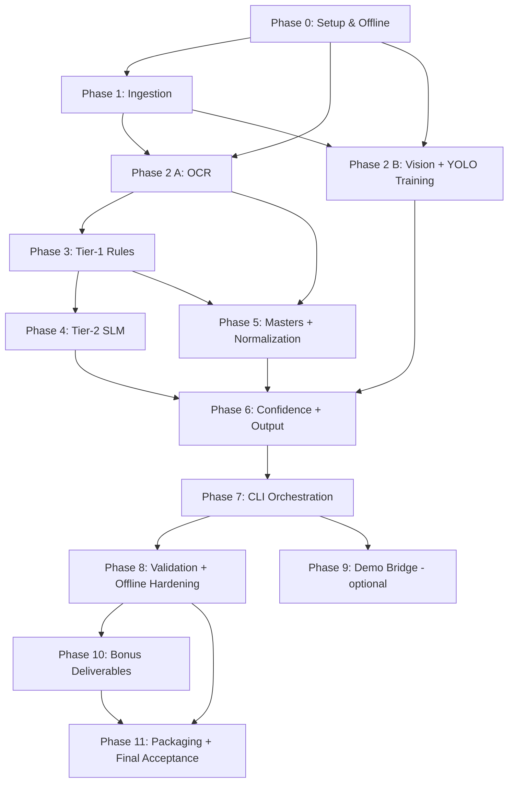

# Implementation Plan

## Overview

This is the build plan for the offline Invoice Extraction Pipeline (`backend/`). The plan is structured in 12 phases over an estimated 9 working days. Phases 0–8 are mandatory for the graded submission. Phase 9 is the optional FastAPI demo bridge for the live demo round. Phase 10 covers bonus-points deliverables. Phase 11 packages and validates the final submission.

Each task is small enough to verify independently, references the requirement IDs from `requirements.md`, and follows the design contracts in `design.md`. The submission zip is assembled at the end from `backend/` only — the React frontend in `src/` and the demo bridge in `demo/` are intentionally excluded from the graded artifact.

Conventions:
- All Python modules go under `backend/` so they don't conflict with the existing React `src/`.
- The submission zip is assembled from `backend/` by `scripts/build_submission.sh`.
- Tasks marked `(bonus)` map to bonus-points requirements (24, 25, 26).
- Requirement IDs in `_Requirements: ..._` lines refer to numbered requirements in `requirements.md`.

## Task Dependency Graph



Critical path: P0 → P1 → P2A → P3 → P4 → P5 → P6 → P7 → P8 → P11.
P2B (Vision + YOLO training) runs in parallel with P2A → P3 → P4 once P0 and P1 are done.
P9 (Demo Bridge) is parallel to P8 once P7 finishes.

```json
{
  "waves": [
    {
      "wave": 1,
      "description": "Foundation: project skeleton, device detection, offline guard, output schema",
      "tasks": [1, 2, 3, 4]
    },
    {
      "wave": 2,
      "description": "Ingestion stage and parallel start of OCR + Vision tracks",
      "tasks": [5, 6, 7, 8, 10]
    },
    {
      "wave": 3,
      "description": "OCR engine, YOLO training, vision inference",
      "tasks": [9, 11, 12]
    },
    {
      "wave": 4,
      "description": "Tier-1 rules + SLM bundle (parallelizable)",
      "tasks": [13, 14, 15, 16]
    },
    {
      "wave": 5,
      "description": "Tier-2 SLM wrapper, anti-hallucination guard, master loader",
      "tasks": [17, 18, 19]
    },
    {
      "wave": 6,
      "description": "Master mining, normalization, confidence, output assembly",
      "tasks": [20, 21, 22, 23, 24]
    },
    {
      "wave": 7,
      "description": "CLI entry point and legacy shim",
      "tasks": [25, 26]
    },
    {
      "wave": 8,
      "description": "Validation harness, pseudo-labels, offline smoke test",
      "tasks": [27, 28, 29, 30]
    },
    {
      "wave": 9,
      "description": "Optional FastAPI demo bridge and frontend wiring",
      "tasks": [31, 32]
    },
    {
      "wave": 10,
      "description": "Bonus: EDA notebook, error analysis, architecture diagram",
      "tasks": [33, 34, 35]
    },
    {
      "wave": 11,
      "description": "Submission packaging and final acceptance dry run",
      "tasks": [36, 37, 38]
    }
  ]
}
```

## Tasks

This is the build plan for the offline Invoice Extraction Pipeline. Tasks are ordered by dependency. Each task lists the requirements it satisfies (matching `requirements.md`) and is small enough to verify independently.

Conventions:
- All Python modules go under `backend/` so they don't conflict with the existing React `src/`.
- The submission zip is assembled at the end from `backend/`.
- Tasks marked `(bonus)` map to bonus-points requirements (24, 25, 26).

---

## Phase 0: Project Setup & Offline Foundation

- [x] 1. Set up the Python backend project skeleton
  - Create `backend/` with subdirectories `utils/`, `models/`, `data/`, `tests/`, `scripts/`, `notebooks/`, `docs/`, `sample_output/`.
  - Add `backend/requirements.txt` with pinned versions: `paddleocr==2.8.1`, `paddlepaddle==2.6.2`, `ultralytics==8.3.0`, `llama-cpp-python==0.3.2`, `PyMuPDF==1.24.13`, `pdf2image==1.17.0`, `Pillow==11.0.0`, `opencv-python-headless==4.10.0.84`, `rapidfuzz==3.10.1`, `pydantic==2.9.2`, `numpy==1.26.4`, `torch==2.4.1`.
  - Add `backend/pyproject.toml` declaring the `utils` package.
  - Add `backend/.gitignore` ignoring `models/*.pt`, `models/*.gguf`, `models/paddleocr/`, `__pycache__/`, `.venv/`.
  - _Requirements: 21.1, 21.2, 21.3, 21.5_

- [x] 2. Implement `utils/device.py` for CUDA auto-detection
  - Define the `Device` enum (`CPU`, `CUDA`) and the `DeviceInfo` dataclass.
  - Implement `detect()` using `torch.cuda.is_available()`, returning `DeviceInfo` with the GPU description when CUDA is present.
  - Log device choice to stderr via the standard `logging` module.
  - Write unit test `tests/unit/test_device.py` that mocks `torch.cuda.is_available` to both branches.
  - _Requirements: 17.1, 17.2, 17.3, 17.4_

- [x] 3. Implement `utils/offline_guard.py` for network kill-switch
  - Set `HF_HUB_OFFLINE=1` and `TRANSFORMERS_OFFLINE=1` in `enable_offline_mode()`.
  - Monkey-patch `socket.socket.connect` to raise `OfflineViolation` for non-loopback addresses.
  - Wrap `urllib.request.urlopen` and `requests.adapters.HTTPAdapter.send` to raise on call.
  - Write unit test that asserts a non-loopback `socket.connect` call raises after the guard is enabled.
  - _Requirements: 16.1, 16.2, 16.3, 16.5_

- [x] 4. Implement `utils/schema.py` with the Pydantic output contract
  - Define `Bbox`, `TextField`, `NumericField`, `VisualField`, `Fields`, and `ExtractionResult` Pydantic v2 models.
  - Add `ExtractionResult.error: str | None = None` for the partial-result error path.
  - Write unit test asserting the round-trip property: `model_dump_json` then `model_validate_json` returns an equal object.
  - Write unit test asserting that null numeric fields serialize to JSON `null`, not `0`.
  - _Requirements: 15.1, 15.2, 10.1, 10.2, 10.3, 10.7, 10.8, 10.9_

---

## Phase 1: Stage 1 — Ingestion

- [x] 5. Implement `utils/ingestion.py` for PDF and image loading
  - Implement `load(path: Path) -> PreprocessedPage` dispatching by extension.
  - Use PyMuPDF for digital PDFs (extract embedded text + per-page rendered images at 300 DPI).
  - Use `pdf2image.convert_from_path(dpi=300)` for scanned PDFs.
  - Use `PIL.Image.open` for `.png`, `.jpg`, `.jpeg`.
  - Raise `UnsupportedFormatError` for any other extension.
  - Raise `CorruptInputError` on parse failure.
  - _Requirements: 1.1, 1.2, 1.3, 1.4, 1.7_

- [x] 6. Add OpenCV preprocessing to ingestion
  - Implement `_deskew(img)` using `cv2.minAreaRect` on connected components.
  - Implement `_denoise(img)` using `cv2.fastNlMeansDenoising`.
  - Implement `_normalize_contrast(img)` using CLAHE on the Y channel of YCrCb color space.
  - Wire these three functions into `load()` so every returned page is preprocessed.
  - Write unit test asserting that a deliberately rotated input is straightened (skew angle of result < 1°).
  - _Requirements: 1.5_

- [x] 7. Implement multi-page relevance scoring
  - Implement `_score_relevance(image, embedded_text)` that combines:
    - Currency anchor presence (`₹`, `Rs.`, `Total`, `Grand Total`)
    - HP anchor presence
    - Brand keyword presence (load brand list from a stub file at this stage; will use `asset_master.json` later)
    - Tabular layout density via Hough-line count
  - For multi-page PDFs, return only the highest-scoring page.
  - Write unit test using a 3-page synthetic PDF where one page is the quotation, two are noise.
  - _Requirements: 1.6_

---

## Phase 2: Stage 2 — OCR + Vision (parallel)

- [x] 8. Bundle PaddleOCR mobile models for en+hi+gu
  - Download (one-time, with internet) PP-OCRv4 mobile detection, recognition, and classification model files for English, Hindi, and Gujarati from PaddleOCR's official model zoo.
  - Place them under `backend/models/paddleocr/` in PaddleOCR's expected layout.
  - Add `backend/models/paddleocr/README.md` listing exact model versions and SHA256 hashes.
  - Verify the directory loads cleanly via `paddleocr.PaddleOCR(use_angle_cls=True, det_model_dir=..., rec_model_dir=..., cls_model_dir=...)` with no internet access.
  - _Requirements: 2.1, 2.2, 16.2_

- [x] 9. Implement `utils/ocr.py` PaddleOCR wrapper
  - Define `OcrToken` dataclass (`text`, `bbox`, `confidence`, `script`).
  - Implement `OcrEngine` class with `__init__(device, models_dir)` and `extract(page) -> list[OcrToken]`.
  - Pass `use_gpu=True` when device is CUDA, `use_gpu=False` otherwise.
  - Detect script per token via Unicode codepoint ranges (Devanagari, Gujarati, Latin, mixed).
  - Write unit test using a small fixture invoice that exercises all three scripts.
  - _Requirements: 2.3, 2.4, 2.5, 17.2, 17.3_

- [x] 10. Annotate sig/stamp seed dataset for YOLO
  - Hand-label between 50 and 80 representative training images using LabelImg in offline desktop mode.
  - Stratify across language (English, Hindi, Gujarati, mixed) and quality (digital, scanned, mobile photo).
  - Save annotations in YOLO format under `train_data_idfc/labels/` matching image filenames.
  - Add `backend/scripts/prepare_yolo_dataset.py` that splits images and labels into 40 train / 10 val / 20 test directories under `train_data_idfc/yolo/`.
  - Add `backend/data/data.yaml` Ultralytics config pointing at the prepared dataset.
  - _Requirements: 20.1, 20.3_

- [x] 11. Implement YOLOv8n training script
  - Create `backend/scripts/train_yolo.py` that loads `yolov8n.pt` (COCO pretrained, bundled in `backend/models/base/yolov8n.pt`) and fine-tunes on the prepared dataset.
  - Apply augmentations: rotation ±5°, brightness, gaussian noise, JPEG compression.
  - Run for 75 epochs at image size 640 by default; surface as CLI flags.
  - Auto-detect device via `utils.device.detect()`; warn if CPU-only.
  - On completion, copy best epoch weights to `backend/models/yolov8n_sig_stamp.pt`.
  - Assert mAP@50 ≥ 0.85 on the held-out test split or exit non-zero.
  - Run on the local RTX 3050 6GB and verify it completes in ≤30 minutes.
  - _Requirements: 19.1, 19.2, 19.3, 19.4, 19.5, 19.6, 4.1 (YOLO half), 4.2, 4.3, 4.4, 4.5_

- [x] 12. Implement `utils/detection.py` YOLOv8n inference wrapper
  - Define `Detection` dataclass (`cls`, `bbox`, `confidence`).
  - Implement `VisionDetector(device, weights_path)` with `detect(page) -> list[Detection]`.
  - Use Ultralytics `YOLO(weights).predict(image, device=device.kind.value)`.
  - Add per-class confidence threshold (signature 0.35, stamp 0.40) read from `backend/models/detection.yaml`.
  - Write unit test against a fixture image with known signature/stamp regions.
  - _Requirements: 3.1, 3.2, 3.3, 3.4, 3.5, 17.2, 17.3_

---

## Phase 3: Stage 3 — Tier 1 Rule Extraction

- [x] 13. Implement `utils/extraction.py` regex anchor library
  - Define anchor patterns for all four text fields exactly as listed in the design doc tables.
  - Include English, Hindi, and Gujarati anchor variants for HP (`HP`, `H.P.`, `hp`, `बल`, `एचपी`, `બળ`).
  - Implement `_match_anchored(tokens, pattern, value_extractor)` returning ranked candidates with confidence.
  - Write parametrized unit tests for each anchor pattern using synthetic `OcrToken` lists.
  - _Requirements: 5.1, 5.2, 5.3, 5.4, 6.1, 7.1_

- [x] 14. Implement Tier-1 extractors per field
  - Implement `_extract_horse_power(tokens)` enforcing the [15, 150] range.
  - Implement `_extract_asset_cost(tokens)` stripping currency symbols/commas/decimals and enforcing [100K, 5M].
  - Implement `_extract_dealer_name(tokens, embedded_text)` using anchors plus letterhead-region heuristic (top ~15% of page).
  - Implement `_extract_model_name(tokens, asset_master)` using anchors plus brand keywords from the loaded asset master.
  - Each function returns a `FieldExtraction` with confidence computed per the formula in the design.
  - Write unit tests for each field's happy path, edge cases (no anchor, multiple candidates, out-of-range values).
  - _Requirements: 4.1, 4.2, 5.5, 6.2, 6.3, 7.2, 7.3, 5.6, 5.7, 5.8_

- [x] 15. Wire Tier-1 orchestrator
  - Implement `extract_text_fields(tokens, embedded_text, asset_master) -> dict[str, FieldExtraction]`.
  - Always returns all four keys; missing fields have `value=None`, `confidence=0.0`, `source="none"`.
  - Track `evidence_token_ids` for each successful extraction.
  - Write integration test on a fixture document where all four fields are extractable with high confidence.
  - _Requirements: 5.5, 5.6, 5.7, 5.8_

---

## Phase 4: Stage 3 Tier 2 — SLM Fallback

- [x] 16. Bundle Qwen2.5-1.5B-Instruct Q4_K_M GGUF
  - Download (one-time, with internet) the Qwen2.5-1.5B-Instruct Q4_K_M GGUF weights from the official Qwen Hugging Face repository.
  - Place at `backend/models/qwen2.5-1.5b-q4_k_m.gguf`.
  - Verify `llama_cpp.Llama(model_path=..., n_ctx=4096, n_gpu_layers=0)` loads with no internet access.
  - Document model SHA256 in `backend/models/README.md`.
  - _Requirements: 6.1, 12.1, 12.6_

- [x] 17. Implement `utils/slm.py` SLM fallback wrapper
  - Implement `SlmFallback(device, model_path)` initializing `llama_cpp.Llama` with `n_gpu_layers=-1` on CUDA, `0` on CPU.
  - Implement `refine(ocr_text, missing_fields) -> dict` issuing a single prompt for all missing fields per document.
  - Use the chat template defined in the design doc verbatim.
  - Parse SLM output with `json.loads`; on parse failure retry once with `temperature=0.0`; on second failure return all-nulls.
  - Enforce 8s per-call timeout via `concurrent.futures`.
  - Write unit test with a mocked Llama client that returns canned JSON.
  - _Requirements: 6.1, 6.2, 6.3, 6.4, 6.7, 6.8, 17.2, 17.3_

- [x] 18. Implement Tier-2 trigger and anti-hallucination guard
  - In `utils/extraction.py`, after Tier-1 returns, identify fields with confidence below 0.55.
  - If any are below threshold, call `SlmFallback.refine` once for the whole document.
  - For `dealer_name` and `model_name`, reject SLM values that aren't substrings of the OCR text after whitespace and case normalization.
  - For `horse_power` and `asset_cost`, reject values outside the field's domain range.
  - When SLM value accepted, set `source="tier2"` and confidence to 0.7 × SLM self-reported confidence.
  - Write unit test where SLM hallucinates a dealer name that's not in OCR text → assert it's rejected and Tier-1 value retained.
  - _Requirements: 6.2, 6.5, 6.6, 6.9_

---

## Phase 5: Stage 4 — Master Mining + Normalization

- [x] 19. Implement `utils/masters.py` master loader
  - Define `DealerEntry`, `AssetEntry`, `Masters` dataclasses.
  - Implement `load(data_dir: Path) -> Masters` reading and validating both JSON files.
  - Validate JSON shape; raise typed error if files are missing or malformed.
  - Write unit test loading fixture master files.
  - _Requirements: 13.1, 13.2_

- [x] 20. Implement dealer master mining script
  - Implement `mine_dealer_master(train_dir, ocr) -> list[DealerEntry]` per the algorithm in the design doc.
  - Use RapidFuzz `token_set_ratio` ≥ 85 for clustering, greedy single-linkage.
  - Filter clusters with frequency < 2 to suppress OCR-noise singletons.
  - Sort output by `canonical` ascending for byte-stable output.
  - Wrap in `backend/scripts/mine_masters.py` CLI.
  - Run on `train_data_idfc/train/` and assert the script writes a non-empty `data/dealer_master.json`.
  - Re-run twice and verify byte-identical output.
  - _Requirements: 12.1, 12.2, 12.3, 12.4, 8.1, 8.3, 8.5, 8.6, 8.7_

- [x] 21. Implement asset master mining script
  - Bundle `backend/data/seed_brands.txt` listing the 12 known Indian tractor brands.
  - Implement `mine_asset_master(train_dir, ocr, seed_brands)` extracting `(brand, model)` triples using brand keyword + model regex.
  - Union mined entries with a hand-curated list of known (brand, model) pairs.
  - Sort by `full_name` ascending for byte-stable output.
  - Add to the same `backend/scripts/mine_masters.py` CLI.
  - Verify deterministic re-run output.
  - _Requirements: 13.1, 13.2, 13.3, 13.4, 8.4, 8.5, 8.7_

- [x] 22. Implement `utils/normalization.py`
  - Implement `normalize(extractions, masters) -> dict[str, NormalizedField]`.
  - Dealer: fuzzy match ≥90 → swap canonical, bump conf; 70–89 → keep raw, multiply conf by 0.85; <70 → multiply by 0.5.
  - Model: case-insensitive whitespace-normalized exact match → swap canonical; miss → multiply conf by 0.7.
  - Horse power: integer coercion; reject outside [15, 150].
  - Asset cost: integer coercion; reject outside [100K, 5M].
  - Add cross-field consistency check: if `(horse_power, asset_cost)` outside ±50% of empirical band midpoint, multiply asset_cost confidence by 0.8.
  - Write unit tests covering every fuzzy-score boundary (89, 90, 70, 69) and every range edge.
  - _Requirements: 7.1, 7.2, 7.3, 7.4, 7.5, 7.6, 7.7, 4.4, 4.5, 4.6, 5.5, 5.6, 6.5, 7.5_

---

## Phase 6: Stage 5 — Confidence + Stage 6 — Output

- [x] 23. Implement `utils/confidence.py`
  - Implement `aggregate(text_fields, visual_fields)` computing per-field and document-level confidences.
  - Use weights from the design (dealer 0.20, model 0.20, hp 0.15, cost 0.20, sig 0.125, stamp 0.125).
  - When a field has confidence 0, redistribute its weight equally to the others before computing.
  - Write unit test asserting weight redistribution gives correct doc-level confidence.
  - _Requirements: 14.1, 14.2, 14.3, 14.4, 9.1, 9.2, 9.3, 9.4, 9.5_

- [x] 24. Implement output assembly in the extraction orchestrator
  - In `executable.py`, build the `ExtractionResult` from normalized fields, vision detections, doc-level confidence, and timing.
  - For visual fields: `signature.present = true` if YOLO returned at least one detection above threshold; `bbox` is the highest-confidence detection.
  - For text fields: wrap value + confidence in `TextField` / `NumericField`.
  - Compute `processing_time_sec` from a `time.monotonic()` baseline captured at process start.
  - Compute `cost_estimate_usd` as `processing_time_sec × commodity_cpu_rate` (default rate `0.0`, configurable).
  - Validate the assembled object via Pydantic.
  - _Requirements: 8.1, 8.2, 8.3, 9.1, 9.2, 9.3, 14.4, 14.5, 15.1, 15.2, 15.3, 15.4, 10.1, 10.2, 10.3, 10.4, 10.5, 10.6_

---

## Phase 7: CLI + Orchestration

- [x] 25. Implement `executable.py` CLI entry point
  - Accept positional `<input_path>`, optional `--output <path>`, `--batch <directory>`, `--offline`, `--legacy`.
  - At top of `main()`, before any model imports: `offline_guard.enable_offline_mode()` if `--offline`, set env vars unconditionally.
  - Initialize `OcrEngine`, `VisionDetector`, `SlmFallback`, masters once and reuse across documents.
  - For single input: emit JSON to stdout AND write to `--output` (default `sample_output/result.json`).
  - For `--batch`: iterate supported files in directory, emit one JSON per line to stdout.
  - Wrap each document's processing in stage-isolated `try/except` so a single failure can't kill batch.
  - Wrap full document in 60s hard timeout.
  - Exit codes: 0 success, 1 schema/validation failure, 2 unsupported input, 3 offline violation.
  - _Requirements: 22.1, 22.2, 22.3, 22.4, 22.5, 11.1, 11.2, 11.3, 11.4, 11.5, 11.6, 11.7, 16.5, 19.1, 19.2, 19.3, 19.4, 19.5_

- [x] 26. Implement `--legacy` flat-output shim
  - Add a serializer that flattens `TextField`/`NumericField`/`VisualField` wrappers into the PS reference shape (e.g. `"horse_power": 50` instead of `{"value": 50, "confidence": 0.95}`).
  - Both shapes ship; `--legacy` swaps to the flat shape if a grader rejects the wrapped shape.
  - Write integration test verifying both shapes are valid JSON and roundtrip-stable in their respective Pydantic models.
  - _Requirements: 15.1, 15.2_

---

## Phase 8: Validation + Offline Hardening

- [ ] 27. Annotate the text-field validation set
  - **MANUAL TASK**: Use `python -m scripts.annotate_validation` to label 30 docs.
  - Hand-label between 30 and 50 documents with all four text fields plus signature/stamp ground-truth bboxes.
  - Stratify across language and document quality.
  - Save labels in `backend/tests/validation/labels.json` as a list of `{doc_id, fields}` records.
  - _Requirements: 20.2, 20.3, 16.1, 16.2_

- [x] 28. Implement validation evaluation harness
  - Create `backend/tests/validation/evaluate.py` that runs the pipeline on every image in `tests/validation/labeled/`, scores against `labels.json` per the match rules in Requirement 11, and outputs a summary report.
  - Compute Document-Level Accuracy, per-field accuracy, latency p50/p95/max, signature/stamp mAP@50, mAP@[50:95].
  - Fail with non-zero exit if DLA < 95% or p95 latency > 30s.
  - _Requirements: 11.1, 11.2, 11.3, 11.4, 11.5, 11.6, 11.7, 18.1, 18.2, 18.3, 18.4, 15.1, 15.2, 15.3, 15.4, 15.5, 15.6_

- [x] 29. Implement pseudo-labeling script
  - Create `backend/scripts/pseudo_label.py` that runs Tier-1 + Tier-2 on every image in `train_data_idfc/train/`.
  - When Tier-1 and Tier-2 agree on a value with both confidences ≥0.85, accept as a pseudo-label.
  - Emit `backend/data/pseudo_labels.json` for downstream use.
  - _Requirements: 20.4, 16.3, 16.4, 16.5_

- [x] 30. Add offline smoke test
  - Create `backend/scripts/smoke_offline.sh` (POSIX) and `.ps1` (Windows) that:
    1. Build a temp venv
    2. `pip install -r requirements.txt`
    3. Run `python executable.py tests/fixtures/sample_invoice.png --offline` with all loopback-only network blocked
    4. Verify a valid JSON is emitted and exit code is 0
  - Document Docker variant with `--network=none` flag in `backend/README.md`.
  - _Requirements: 16.4, 12.3_

---

## Phase 9: Frontend Wiring (Optional Demo Bridge)

- [x] 31. Implement FastAPI demo bridge under `demo/`
  - Add `demo/server.py` exposing `GET /api/health` and `POST /api/extract` over `127.0.0.1:8000`.
  - Reuse the `backend/utils/*` modules; do not duplicate code.
  - Add `demo/requirements.txt` listing FastAPI and uvicorn (separate from submission's `backend/requirements.txt`).
  - Add `demo/README.md` documenting how to start the server and how to point the React frontend at it.
  - Make absolutely sure `demo/` is excluded from the submission zip script.
  - _Requirements: 23.1, 23.2, 23.3, 23.4, 23.5, 23.6_

- [x] 32. Wire React frontend to call the bridge
  - In `src/app/pages/Upload.tsx`, replace the simulated `setTimeout` pipeline with a real `fetch('/api/extract', {method: 'POST', body: formData})` call.
  - Map the response into the existing Zustand store schema (`dealerName`, `modelName`, `horsePower`, `assetCost`, `signatureDetected`, `stampDetected`).
  - On mount, call `/api/health`; if it fails, retain the simulated path as fallback and show a non-blocking toast.
  - Add Vite dev-server proxy in `vite.config.ts` routing `/api/*` to `http://127.0.0.1:8000`.
  - _Requirements: 23.7, 23.8_

---

## Phase 10: Bonus Deliverables

- [x] 33. Build EDA notebook (bonus)
  - Create `backend/notebooks/eda.ipynb`.
  - Add cells for: state distribution from address tokens, language distribution from PaddleOCR script detection, digital-vs-scanned split, layout clustering via image-feature embeddings, processing-time analysis on a 30-doc sample.
  - Verify notebook runs end-to-end with no internet access.
  - _Requirements: 24.1, 24.2, 24.3, 24.4, 24.5, 24.6, 24.7, 17.1, 17.4_

- [x] 34. Build error analysis report (bonus)
  - Create `backend/docs/error_analysis.md` (or notebook).
  - Run validation evaluation; classify failures into categories (OCR error, rule miss, SLM hallucination, master miss, detection miss).
  - Include per-field confusion matrix and at least three concrete examples per category showing input page, OCR output, and predicted vs ground-truth values.
  - _Requirements: 25.1, 25.2, 25.3, 25.4, 17.2, 17.4_

- [x] 35. Generate architecture diagram (bonus)
  - Add Mermaid diagram to `backend/README.md` matching the diagram in `design.md`.
  - Export to PNG at `backend/docs/architecture.png` using mermaid-cli (offline) or a screenshot.
  - _Requirements: 26.1, 26.2, 26.3, 17.3, 17.4_

---

## Phase 11: Submission Packaging

- [x] 36. Write submission `README.md`
  - Sections: overview, architecture (Mermaid + PNG), pipeline stages, cost analysis, error analysis, run instructions.
  - Include the exact one-liner: `python executable.py <input_path>` with `--output`, `--batch`, `--offline`, `--legacy` flag documentation.
  - Include hardware requirements table (CPU floor, GPU optional).
  - Include reproducibility section pointing at `mine_masters.py` and `train_yolo.py`.
  - _Requirements: 21.4, 17.4_

- [x] 37. Implement submission build script
  - Create `backend/scripts/build_submission.sh` and `.ps1` that:
    1. Verify all required files exist (executable.py, requirements.txt, README.md, utils/, models/paddleocr/, yolov8n_sig_stamp.pt, qwen2.5-1.5b-q4_k_m.gguf, data/dealer_master.json, data/asset_master.json, sample_output/result.json, docs/architecture.png).
    2. Create a clean staging directory.
    3. Copy required files (excluding `demo/`, `tests/`, `notebooks/`, `scripts/`, `train_data_idfc/`, `__pycache__/`, virtual envs).
    4. Run a sample extraction inside the staging dir to refresh `sample_output/result.json`.
    5. Zip into `submission.zip`.
    6. Print final size and a manifest.
  - _Requirements: 21.1, 21.2, 21.3, 21.4, 21.5, 21.6, 21.7, 21.8, 21.9, 21.10_

- [ ] 38. Final acceptance dry run
  - Run `build_submission.sh`.
  - Unzip to a fresh directory, create a fresh venv, run `pip install -r requirements.txt`.
  - Run `python executable.py tests/fixtures/sample_invoice.png --offline` inside a `--network=none` Docker container.
  - Run `python executable.py --batch tests/validation/labeled/ --offline` and assert DLA ≥95% and p95 latency ≤30s.
  - Verify the result JSON validates against the PS schema.
  - _Requirements: 18.1, 18.2, 18.3, 18.4, 16.1, 16.2, 16.3, 16.4, 16.5, 21.10, 12.3, 12.4_


## Notes

- **Hardware:** development machine has an RTX 3050 6GB. All model bundling, fine-tuning, and validation runs locally and offline. The submission must run on either CPU-only or low-tier GPU at the evaluator's discretion — task 25 implements the auto-detect that makes one artifact work on both.

- **No-paid-services rule:** every dependency in `requirements.txt` is open-source and PyPI-installable. No HuggingFace Inference API, no OpenAI, no Google Vision, no AWS Textract anywhere in the codebase. The offline guard in task 3 enforces this at runtime.

- **Submission size:** no upper bound was set by the user, but the staging script in task 37 logs the final zip size. Expected ~1.2 GB (Qwen 1.5B Q4 GGUF dominates).

- **Master files:** organizers did not ship a dealer or asset master. Tasks 20 and 21 mine them from the training data. If organizers later release official masters, only tasks 20 and 21 need to be re-run; everything downstream uses the same `data/dealer_master.json` and `data/asset_master.json` interface.

- **Annotation effort:** task 10 (sig/stamp annotation, 50–80 images) and task 27 (text-field validation set, 30–50 images) are the only blocking manual work. Both can be parallelized with infrastructure tasks.

- **Frontend wiring:** the React frontend in `src/` already has the right Zustand schema and pages. Task 32 is a small surgical change to `src/app/pages/Upload.tsx` only. The simulated 5-step pipeline stays as a fallback when the demo bridge is unreachable.

- **Daily checkpoint:** at the end of each phase, run `backend/scripts/eval.sh` to ensure DLA hasn't regressed. The script combines the validation evaluation, the offline smoke test, and the latency check into one go/no-go signal.
