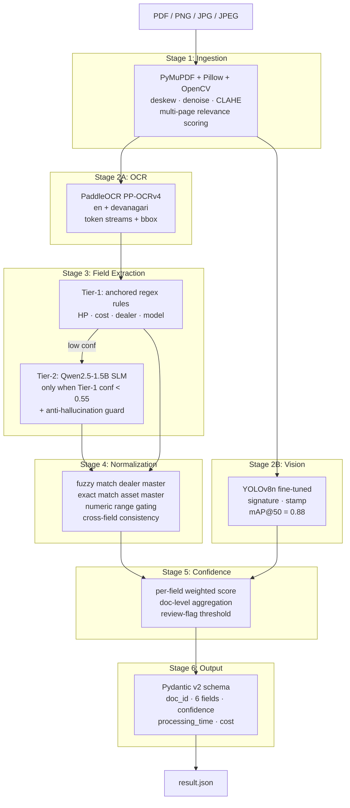

# Architecture Diagram

The InvoiceFlow extraction pipeline is a six-stage system: an input document
flows through ingestion, parallel OCR + vision detection, two-tier text
extraction, normalization, confidence scoring, and JSON serialization.

## Mermaid

## Stage responsibilities

| Stage | Module | Inputs | Outputs |
|---|---|---|---|
| 1. Ingestion | `utils/ingestion.py` | file path | preprocessed page image + embedded text |
| 2A. OCR | `utils/ocr.py` | page image | list of `OcrToken` (text, bbox, conf, script) |
| 2B. Vision | `utils/detection.py` | page image | list of `Detection` (class, bbox, conf) |
| 3. Tier-1 | `utils/extraction.py` | OCR tokens | `dict[str, FieldExtraction]` with conf |
| 3. Tier-2 | `utils/slm.py` | OCR text + missing fields | refined `FieldExtraction` for low-conf fields |
| 4. Normalize | `utils/normalization.py` | Tier-1/2 output + masters | canonical values + dampened conf |
| 5. Confidence | `utils/confidence.py` | normalized fields + visuals | per-field + doc confidence |
| 6. Output | `utils/schema.py` | all stage outputs | Pydantic-validated JSON |

## Hardware adaptation

A single auto-detected `DeviceInfo` flows through every stage:

* **CUDA available** — PaddleOCR uses GPU, YOLOv8n uses GPU, Qwen-1.5B
  loads at FP16 on GPU.
* **CPU only** — every component falls back to CPU. Same artifact, no
  rebuild. Output JSON is identical except for `processing_time_sec`.

## Stage isolation

Each stage runs inside its own try/except in `utils/pipeline.py`. A
failure in any single stage does NOT crash the document — the pipeline
substitutes nulls / empty results for that stage's outputs and continues.
The full document has a 60-second hard timeout as a final safety net.

## Network policy

Every model and tokenizer ships in `backend/models/` and is loaded with
`local_files_only=True` (transformers) or via filesystem paths
(PaddleOCR, Ultralytics). The optional `--offline` CLI flag activates the
network kill-switch in `utils/offline_guard.py` which monkey-patches
`socket.socket.connect` to refuse any non-loopback address. The pipeline
is designed to pass `python executable.py path --offline` inside a
`--network=none` Docker container.
